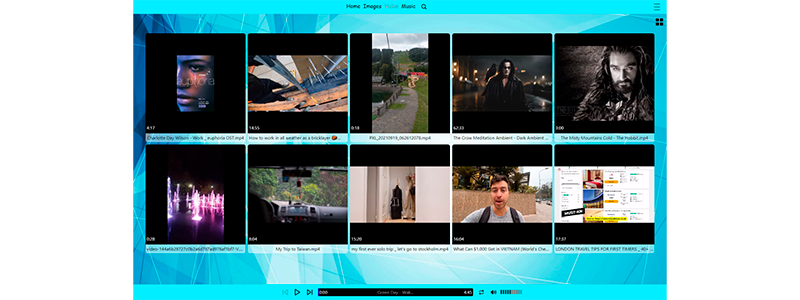

# FireDrive

Stream and store your files with ease!

Version: 2.0

Developer: ThulsaDoom

### OverView:

## Stack

### Features:

- Upload Media (images, video, audio)
- View/listen uploaded content
- Share media via Telegram / Viber / Facebook
- Rename media
- Delete current/all media.
- Sort content by name/size/uploaded date
- manage media layout (video/images)
- Choose theme (3 themes available)
- Manage pagination
- Search fully functional
- Change user avatar
- Fully adaptive

#### Authorization: 

- Email/Password (Email verification required)
- Google / Github
- Restore login info 
